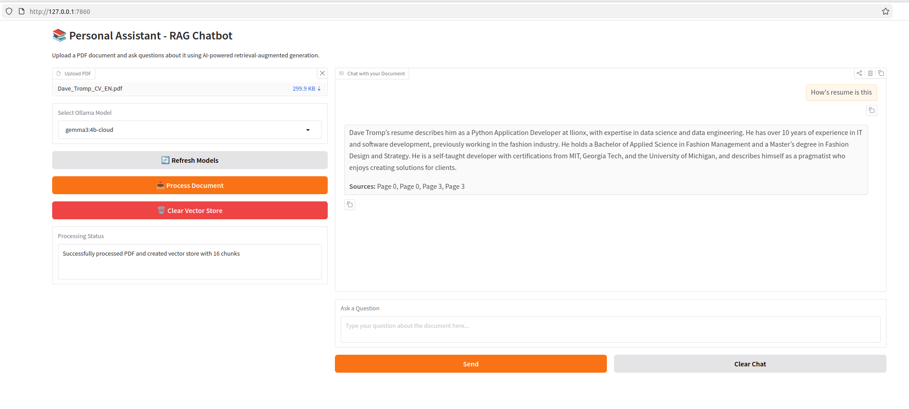

# Personal Assistant - RAG Chatbot

A modern Retrieval-Augmented Generation (RAG) chatbot that allows you to upload PDF documents and ask questions about them using AI-powered natural language processing.

## Screenshot


## Features

- 📄 **PDF Upload & Processing**: Upload any PDF document for AI analysis
- 🤖 **Ollama Integration**: Use local LLM models via Ollama
- 🔍 **Intelligent Retrieval**: Advanced vector similarity search for relevant context
- 💬 **Interactive Chat**: Natural conversation interface with document awareness
- 🎯 **Model Selection**: Choose from available Ollama models
- 📊 **Source Tracking**: See which pages information comes from
- 🔄 **Vector Persistence**: Stores processed documents efficiently

## Technology Stack

- **Python**: Core programming language
- **Gradio**: Modern web-based UI framework
- **LangChain**: Framework for building LLM applications
- **ChromaDB**: Vector database for document embeddings
- **Sentence-Transformers**: State-of-the-art embeddings (all-MiniLM-L6-v2)
- **Ollama**: Local LLM inference
- **PyPDF2**: PDF text extraction

## Project Structure

```
PersonalAssistant2/
├── app.py                 # Main application with Gradio interface
├── requirements.txt       # Python dependencies
├── README.md             # This file
├── uploads/              # Directory for uploaded PDFs (auto-created)
└── vector_store/         # Chroma vector database (auto-created)
```

## How It Works

### Architecture

The application implements a RAG (Retrieval-Augmented Generation) pipeline:

1. **Document Ingestion**: PDFs are uploaded and text is extracted using PyPDF2
2. **Text Chunking**: Documents are split into manageable chunks (1000 characters with 200 overlap)
3. **Embedding Generation**: Each chunk is converted to vector embeddings using sentence-transformers
4. **Vector Storage**: Embeddings are stored in ChromaDB for fast similarity search
5. **Query Processing**: User questions are embedded and matched against document chunks
6. **Context Retrieval**: Top 4 most relevant chunks are retrieved
7. **Response Generation**: Ollama LLM generates answers using retrieved context
8. **Source Attribution**: Response includes page numbers for reference

### Key Components

1. **PDF Processing Module** (`app.py`):
   - Uses LangChain's PyPDFLoader for text extraction
   - Implements RecursiveCharacterTextSplitter for optimal chunking

2. **Vector Database** (`app.py`):
   - ChromaDB with persistent storage
   - HuggingFace embeddings (all-MiniLM-L6-v2)
   - Efficient similarity search with k=4 retrieval

3. **RAG Pipeline** (`app.py`):
   - LangChain RetrievalQA chain
   - Custom prompt template for context-aware responses
   - source_documents tracking for page references

4. **Ollama Integration** (`app.py`):
   - Dynamic model discovery
   - Seamless LLM inference
   - Model selection flexibility

5. **Gradio Interface** (`app.py`):
   - File upload component
   - Model selection dropdown
   - Chat interface with history
   - Real-time status updates

## Installation

### Prerequisites

1. **Python 3.8+**: Ensure Python is installed
   ```bash
   python --version
   ```

2. **Ollama**: Install Ollama for local LLM inference
   - **Linux/Mac**:
     ```bash
     curl -fsSL https://ollama.com/install.sh | sh
     ```
   - **Windows**: Download installer from https://ollama.com/download

3. **Download an Ollama Model**:
   After installing Ollama, download at least one model:
   ```bash
   ollama pull llama3.2
   ollama pull mistral
   ollama pull gemma3
   ```

   See [Ollama Models](https://ollama.com/library) for available models.

### Step-by-Step Installation

1. **Navigate to the project directory**:
   ```bash
   cd PersonalAssistant
   ```

2. **Install Python dependencies**:
   ```bash
   pip install -r requirements.txt
   ```

3. **Verify Ollama is running**:
   ```bash
   ollama list
   ```
   You should see the models you've pulled.

4. **Install additional dependencies if needed**:
   ```bash
   pip install torch  # For sentence-transformers
   ```

5. **Download embeddings model** (downloads automatically on first run):
   - sentence-transformers/all-MiniLM-L6-v2 (~120MB)

### Troubleshooting Installation

**Issue**: ModuleNotFoundError for langchain_community
```bash
pip install langchain-community
```

**Issue**: Ollama connection error
```bash
# Start Ollama service (Linux/Mac)
ollama serve

# Or restart Ollama (Windows)
# Stop and restart the Ollama application
```

**Issue**: Download issues with sentence-transformers
```bash
pip install --upgrade sentence-transformers
```

## Usage

### Starting the Application

Run the application:
```bash
python app.py
```

The interface will start and provide:
- Local URL: `http://localhost:7860`
- Public share URL (optional)

### Basic Workflow

1. **Upload a PDF Document**:
   - Click "Upload PDF" button
   - Select your PDF file from your computer
   - The file will be copied to the `uploads/` directory

2. **Select Ollama Model**:
   - Choose from available models in the dropdown
   - Models that work well:
     - `llama2` - Balanced performance
     - `mistral` - Fast and accurate
     - `codellama` - Great for technical documents
   - Click "Refresh Models" if you've added new models

3. **Process the Document**:
   - Click "Process Document" button
   - Wait for processing (depends on PDF size)
   - You'll see a success message with chunk count

4. **Chat with Your Document**:
   - Type your question in the text box
   - Press Enter or click "Send"
   - The AI will answer based on document content
   - Sources include page numbers for reference

5. **Continue the Conversation**:
   - Ask follow-up questions
   - Chat history is maintained
   - Context is preserved across queries

### Advanced Features

**Multiple Documents**:
- Upload and process additional PDFs
- They're added to the existing vector store
- All documents are searched simultaneously

**Clear Vector Store**:
- Click "Clear Vector Store" to reset
- Removes all processed documents
- Fresh start for new documents

**Clear Chat**:
- Click "Clear Chat" to reset conversation
- Keeps processed documents intact

**Model Switching**:
- Change models anytime
- Re-process document with new model if needed

### Example Questions

- "What are the main topics discussed in this document?"
- "Explain the methodology used in page 5."
- "What are the key findings mentioned?"
- "Summarize the conclusion section."
- "What data is presented in the charts?"

### Best Practices

1. **Document Quality**:
   - Use text-searchable PDFs
   - OCR'd PDFs may work less accurately
   - Clean, well-formatted documents perform best

2. **Question Formulation**:
   - Be specific and clear
   - Reference page numbers when possible
   - Ask follow-up questions for deeper insights

3. **Model Selection**:
   - Use faster models for quick answers (mistral)
   - Use larger models for complex reasoning (llama2)
   - Consider model size vs. performance trade-offs

4. **Resource Management**:
   - Clear vector store for new topics
   - Processed documents persist between sessions
   - Large PDFs may take longer to process

## Development

### Running in Debug Mode

Modify the last line in `app.py`:
```python
app.launch(server_name="0.0.0.0", server_port=7860, share=False, debug=True)
```

### Customizing Chunk Size

Edit in `app.py` (line ~40):
```python
text_splitter = RecursiveCharacterTextSplitter(
    chunk_size=1000,
    chunk_overlap=200,
    length_function=len
)
```

### Changing Retrieval Parameters

Edit in `app.py` (line ~66):
```python
retriever=vector_store.as_retriever(search_kwargs={"k": 4})
```
Adjust `k` to retrieve more/fewer chunks.

### Custom Prompt Template

Edit the template in `app.py` (line ~57):
```python
prompt_template = PromptTemplate(
    template="""Your custom prompt template here...""",
    input_variables=["context", "question"]
)
```

## API Reference

### Main Functions

- `get_available_models()`: Fetches Ollama models
- `load_pdf_and_create_vector_store()`: Processes PDF and creates embeddings
- `process_file()`: Handles file upload and processing
- `chat_response()`: Generates answers from documents
- `clear_vector_store()`: Resets vector database
- `create_interface()`: Builds Gradio UI

### State Variables

- `qa_chain`: LangChain retrieval chain (Gradio State)
- `vector_store`: ChromaDB instance
- `embeddings`: HuggingFace embeddings model

## Performance Considerations

- **Processing Time**: ~1-5 seconds per page for PDFs
- **Memory Usage**: ~200MB base + ~50MB per 100 pages
- **Query Speed**: ~2-5 seconds for answers
- **Storage**: ~1MB per 100 pages (vector store)

## Limitations

- Only text-searchable PDFs supported
- Images and charts not processed
- Maximum accuracy depends on PDF quality
- Requires sufficient system RAM for vector operations
- Ollama model performance varies by hardware

## Troubleshooting

**Issue**: "Please upload a PDF file first"
- Ensure you've clicked "Process Document" after uploading

**Issue**: Model not appearing in dropdown
- Click "Refresh Models"
- Ensure Ollama is running
- Verify model is downloaded: `ollama list`

**Issue**: "Error processing PDF"
- Check file is a valid PDF
- Ensure sufficient disk space
- Check file permissions

**Issue**: Slow response times
- Try a faster Ollama model (mistral)
- Reduce chunk count (lower k parameter)
- Check system resources

**Issue**: Incorrect answers
- Try a larger model (llama2)
- Increase retrieval chunks (raise k parameter)
- Rephrase your question

## Future Enhancements

Potential improvements:
- Support for multiple document formats (DOCX, TXT)
- Image and chart analysis
- Export chat history
- Document comparison features
- User authentication
- Multi-language support
- Advanced search filters

## License

This project is provided as-is for educational and personal use.

## Contributing

Contributions are welcome! Please ensure:
- Code follows existing style
- Changes are tested
- Documentation is updated

## Support

For issues or questions:
1. Check this README first
2. Review Ollama documentation: https://ollama.com
3. Review LangChain documentation: https://python.langchain.com

## Acknowledgments

Built with:
- [Gradio](https://gradio.app)
- [LangChain](https://python.langchain.com)
- [ChromaDB](https://trychroma.com)
- [Ollama](https://ollama.com)
- [Sentence-Transformers](https://www.sbert.net)

---

**Version**: 1.0  
**Last Updated**: 2026-02-09