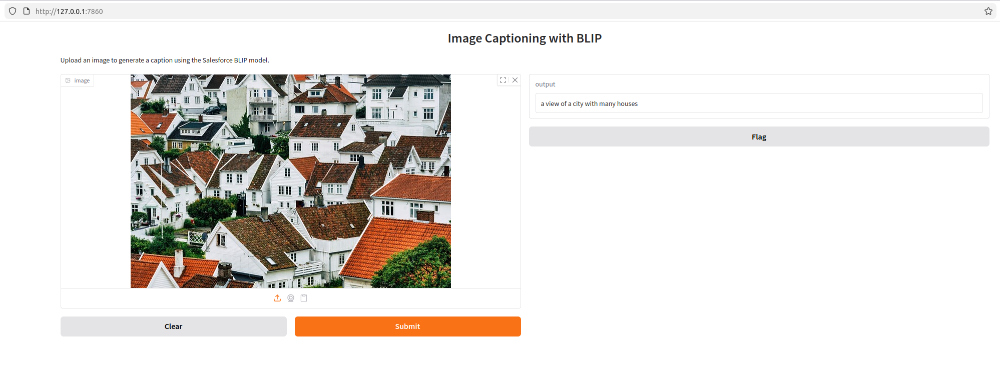
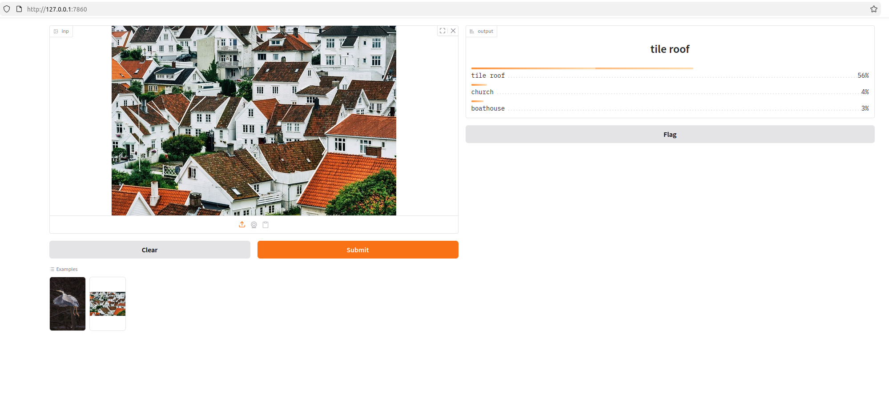
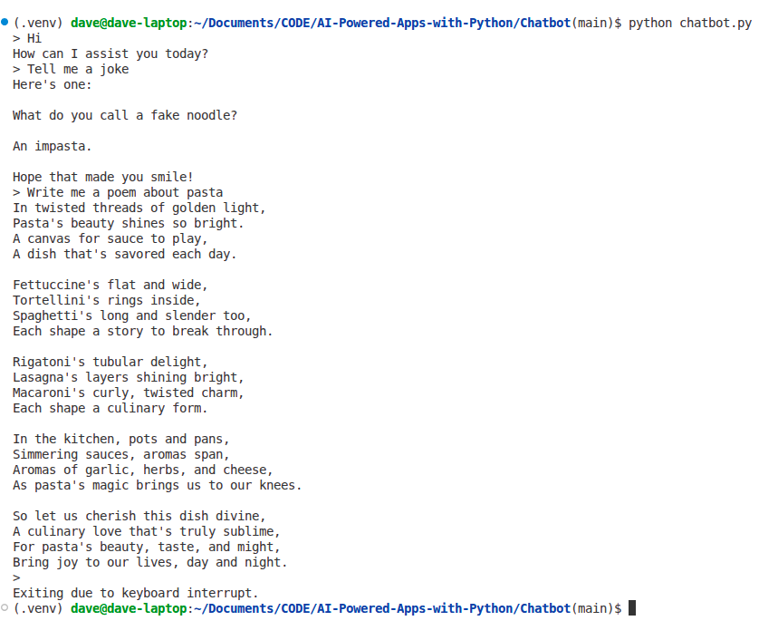
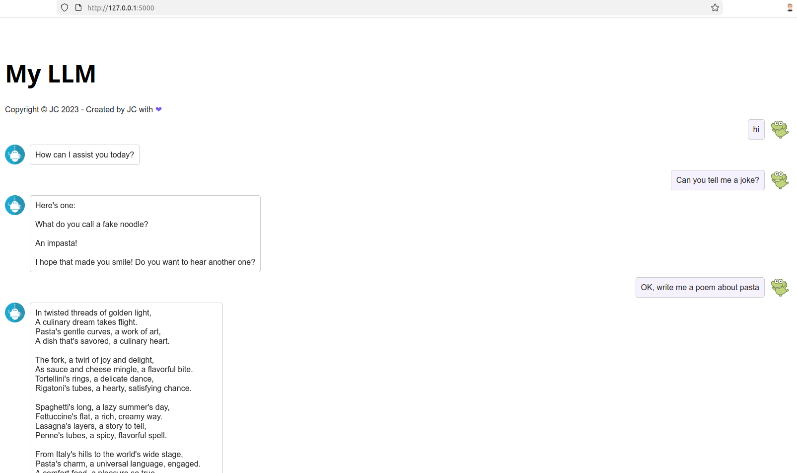

# Generative AI-Powered Apps with Python
A collection of applications written in python that use Generative AI to do useful things. Hopefully.

I have developed these apps as a prove of concept as part of the following IBM course at Coursera: https://www.coursera.org/learn/building-gen-ai-powered-applications/

## Module 1: Image Captioning with Generative AI
 This project involves:

* Implementing an image captioning tool using the BLIP model from Hugging Face’s Transformers.
* Using Gradio to provide a user-friendly interface for our image captioning application.
* Adapting the tool for real-world business scenarios, demonstrating its practical applications.

### Screenshots

## Module 2: My Own ChatGPT-Like Website
This project involves:

* Creating a chatbot using an open LLM from Huggingface
* Have a CLI chatbot
* Have a Web chatbot

### Screenshots

## Module 3: Create a Voice Assistant
This project involves:

* Creating a chatbot using a ollama and llama3.2:1b
* Have a STT ability using OpenAi's Whisper
* Have a TTS ability using 3 different TTS engines

### Screenshot

