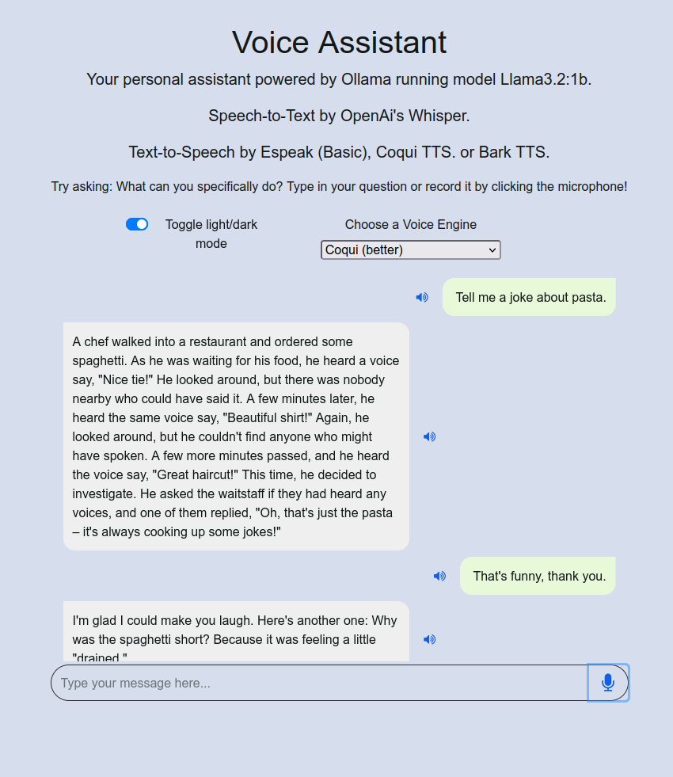

# Voice Assistant

A fully local, privacy-focused voice assistant web application powered by open-source AI models. No cloud services or API keys required!



## Features

- **100% Local Operation** - All processing happens on your machine
- **Voice Input** - Record your voice using the microphone button
- **Text Input** - Type messages directly in the chat interface
- **Multiple TTS Engines**:
  - **Basic (espeak)** - Fast, lightweight, slightly robotic
  - **Coqui TTS** - Better quality, still fast
  - **Bark TTS** - Best quality, slower on CPU
- **Speech-to-Text** - Powered by OpenAI's Whisper
- **Conversational Memory** - Maintains context throughout the conversation
- **Light/Dark Mode** - Toggle between visual themes
- **Audio Replay** - Replay any voice message from the chat history
- **Docker Support** - Easy containerized deployment

## Architecture

### Tech Stack

- **Frontend**:
  - Flask (Python web framework)
  - Bootstrap 4 (CSS framework)
  - jQuery (JavaScript library)
  - Font Awesome (Icons)

- **Backend**:
  - **LLM**: Ollama with Llama 3.2:1b model
  - **STT**: OpenAI Whisper (base model)
  - **TTS**: 
    - pyttsx3 (espeak) - Basic
    - Coqui TTS - Medium
    - Bark (HuggingFace) - High quality

### How It Works

1. **Voice Input** → Audio captured via browser's MediaRecorder API
2. **Speech-to-Text** → Whisper transcribes audio to text
3. **Message Processing** → Ollama's Llama 3.2:1b generates a response with context
4. **Text-to-Speech** → Selected TTS engine converts response to audio
5. **Response Delivery** → Audio (base64) and text sent to frontend
6. **Playback** → Audio played automatically, with replay option

## System Requirements

### Minimum Requirements
- **OS**: Debian/Ubuntu Linux (or equivalent)
- **Python**: 3.13+
- **RAM**: 8GB (16GB+ recommended for better performance)
- **CPU**: 4+ cores (Bark TTS benefits from more cores)
- **Disk**: 10GB+ free space (for models and dependencies)

### Required System Packages
- `espeak-ng` and `libespeak1` - Basic TTS
- `mbrola` and `mbrola-us2` - Enhanced voice
- `ffmpeg` - Audio processing
- `zstd` - Ollama compression (Docker)

## Installation

### Option 1: Run Locally on Debian/Ubuntu Linux

#### Step 1: Install System Dependencies

```bash
sudo apt update
sudo apt -y install espeak-ng libespeak1 mbrola mbrola-us2 ffmpeg
```

#### Step 2: Install Ollama

```bash
curl -fsSL https://ollama.com/install.sh | sh
```

#### Step 3: Start and Configure Ollama

```bash
sudo systemctl enable ollama
sudo systemctl start ollama
ollama pull llama3.2:1b
```

#### Step 4: Create and Activate Virtual Environment

```bash
python3 -m venv .venv
source .venv/bin/activate
```

#### Step 5: Install Python Dependencies

```bash
pip install -r requirements.txt
```

#### Step 6: Configure Environment Variables (Optional)

Create a `.env` file in the project root:

```bash
# For faster HuggingFace model downloads
HF_TOKEN="your_huggingface_token_here"
```

Get your HF_TOKEN from: https://huggingface.co/settings/tokens

#### Step 7: Run the Server

```bash
python server.py
```

The application will be available at: `http://localhost:8000`

### Option 2: Run with Docker

#### Step 1: Build the Docker Image

```bash
docker build -t voice-assistant .
```

#### Step 2: Modify the Dockerfile

Before building, update line 21 with your HuggingFace token:

```dockerfile
ENV HF_TOKEN="YOUR-TOKEN-FROM-HUGGINGFACE"
```

#### Step 3: Run the Container

```bash
docker run -p 8000:8000 voice-assistant
```

The application will be available at: `http://localhost:8000`

## Configuration

### Environment Variables

Create a `.env` file in the project root:

```bash
# HuggingFace token for faster model downloads (optional but recommended)
HF_TOKEN=hf_your_token_here

# OpenAI API key (not used - kept for compatibility)
OPENAI_API_KEY=sk-...
```

### TTS Engine Selection

Choose your preferred TTS engine from the dropdown in the UI:

- **Basic/Default** - Uses espeak (fastest, ~1s)
- **Coqui** - Uses Coqui TTS (medium speed, ~3-5s)
- **Bark** - Uses Bark from HuggingFace (slowest, ~10-30s on CPU)

### Model Configuration

The application uses these default models:

- **LLM**: `llama3.2:1b` (can be changed in `worker.py:98`)
- **STT**: `base` (can be changed in `worker.py:18`)
- **TTS**: `tts_models/eng/fairseq/vits` (can be changed in `worker.py:19`)

## Usage

### Getting Started

1. Open your browser and navigate to `http://localhost:8000`
2. Choose your preferred TTS engine from the dropdown
3. Select light or dark mode using the toggle

### Voice Interaction

1. Click the **microphone button** to start recording
2. Speak your question (button turns red while recording)
3. Click the **send button** to stop recording and process
4. The assistant will transcribe your speech and respond
5. Listen to the audio response - it plays automatically

### Text Interaction

1. Click in the text input field
2. Type your message
3. Press **Enter** or click the **send button** (paper plane icon)
4. The assistant will respond in both text and audio

### Replay Messages

- Click the **volume icon** next to any message to replay it
- User recordings are saved for replay
- Bot responses can be replayed anytime

### Sample Questions

Try asking:
- "What can you do?"
- "Tell me a joke"
- "Explain quantum computing in simple terms"
- "What's the weather today?" (limitation: no internet access)
- "Write a short poem about technology"

## API Documentation

### Endpoints

#### `GET /`
Returns the main web interface.

#### `POST /speech-to-text`

Transcribes audio to text using Whisper.

**Request:**
- Body: Raw audio binary (audio/mpeg)

**Response:**
```json
{
  "text": "transcribed text here"
}
```

#### `POST /process-message`

Processes user message and returns AI response with audio.

**Request:**
```json
{
  "userMessage": "your message here",
  "voice": "basic|coqui|bark"
}
```

**Response:**
```json
{
  "ollamaResponseText": "AI response text",
  "ollamaResponseSpeech": "base64-encoded-audio"
}
```

## Project Structure

```
VoiceAssistant/
├── server.py              # Flask server and API endpoints
├── worker.py              # Core logic (STT, LLM, TTS)
├── requirements.txt       # Python dependencies
├── Dockerfile            # Docker configuration
├── .env                  # Environment variables (create this)
├── README.md             # This file
├── LICENSE               # Apache 2.0 License
├── screenshots/
│   └── Screenshot-VoiceChat.png
├── templates/
│   └── index.html        # Main web interface
└── static/
    ├── script.js         # Frontend JavaScript
    └── style.css         # Custom CSS styling
```

### Key Files

- **server.py** (lines 12-64) - Flask routes for the API
- **worker.py** (lines 22-105) - Core AI processing functions
- **templates/index.html** (lines 1-99) - Web UI layout
- **static/script.js** (lines 1-246) - Client-side logic, recording, audio playback

## Troubleshooting

### Common Issues

#### 1. "Could not import module espeak"
**Solution**: Install espeak:
```bash
sudo apt update && sudo apt install espeak-ng libespeak1 mbrola mbrola-us2
```

#### 2. "ffmpeg not found"
**Solution**: Install ffmpeg:
```bash
sudo apt install ffmpeg
```

#### 3. "Ollama connection failed"
**Solution**: Ensure Ollama is running:
```bash
sudo systemctl status ollama
sudo systemctl start ollama
```

#### 4. Bark TTS is very slow
**Solution**: This is expected on CPU. Use Coqui or Basic TTS for faster responses, or run with GPU acceleration.

#### 5. HuggingFace model download fails
**Solution**: Set your HF_TOKEN in `.env`:
```bash
HF_TOKEN=hf_your_token_here
```

#### 6. Docker container exits immediately
**Solution**: Dockerfile uses `systemctl` which doesn't work in containers. Use the local installation method instead, or modify the Dockerfile to start ollama manually.

#### 7. Port 8000 already in use
**Solution**: Change the port in `server.py` (line 69):
```python
app.run(port=8080, host='0.0.0.0')
```

#### 8. Whisper model download hangs
**Solution**: Pre-download the model:
```bash
python -c "import whisper; whisper.load_model('base')"
```

#### 9. "ModuleNotFoundError: No module named 'flask'"
**Solution**: Ensure virtual environment is activated:
```bash
source .venv/bin/activate
pip install -r requirements.txt
```

### Performance Tips

- Use **Basic TTS** for fastest responses
- Use **Coqui TTS** for balanced quality and speed
- Use **Bark TTS** only when quality is more important than speed
- Close other applications to free up RAM
- Ensure you have sufficient disk space for model caching
- Consider using a GPU for Bark TTS if available

## Limitations

- **No Internet Access**: The LLM only knows what was in its training data
- **CPU-Only by Default**: Bark TTS is slow without GPU
- **Language Support**: Optimized for English (other languages may have lower quality)
- **Context Window**: Limited conversation memory (Llama 3.2:1b specific)
- **No Persistent Storage**: Conversation history is lost on restart

## Credits & License

This project is based on the framework provided by the **Coursera course / IBM Skills Network** under the **Apache License 2.0**.

It has been significantly modified to:
- Use only locally-hosted services
- Replace cloud APIs with open-source models
- Add support for multiple TTS engines
- Enhance the user interface and experience

### Used Libraries & Models

- [Ollama](https://github.com/ollama/ollama) - Local LLM inference
- [OpenAI Whisper](https://github.com/openai/whisper) - Speech-to-Text
- [Coqui TTS](https://github.com/idiap/coqui-ai-TTS) - Text-to-Speech
- [Bark](https://github.com/suno-ai/bark) - High-quality TTS
- [Flask](https://flask.palletsprojects.com/) - Web framework
- [pyttsx3](https://pyttsx3.readthedocs.io/) - Basic TTS

## License

```
Copyright 2020 IBM Developer Skills Network
Modifications for local-only operation

Licensed under the Apache License, Version 2.0 (the "License");
you may not use this file except in compliance with the License.
You may obtain a copy of the License at

    http://www.apache.org/licenses/LICENSE-2.0

Unless required by applicable law or agreed to in writing, software
distributed under the License is distributed on an "AS IS" BASIS,
WITHOUT WARRANTIES OR CONDITIONS OF ANY KIND, either express or implied.
See the License for the specific language governing permissions and
limitations under the License.
```

## Contributing

Contributions are welcome! Please feel free to submit issues or pull requests.

## Support

For issues or questions:
- Check the [Troubleshooting](#troubleshooting) section
- Review the [API Documentation](#api-documentation)
- Examine the code comments in `server.py` and `worker.py`

---

Made with ❤️ using entirely open-source AI models